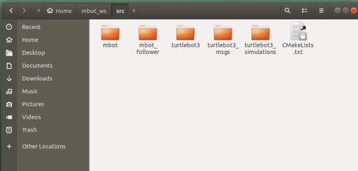

# mbot多智能体协同仿真

#### 介绍
本仓库是，mbot多智能体协同仿真作业仓库，可实现，机器人编队，多机器人导航功能

#### 环境配置

系统：`ubuntu18.04`+`ROS Melodic`

> ROS安装教程：[ROS Melodic 安装必成功流程+避坑指南（超详细）_HinGwenWoong的博客-CSDN博客_ros melodic](https://blog.csdn.net/hxj0323/article/details/121215992)

需要安装的包：

```bash
sudo apt-get install ros-melodic-joy ros-melodic-teleop-twist-joy ros-melodic-teleop-twist-keyboard ros-melodic-laser-proc ros-melodic-rgbd-launch ros-melodic-depthimage-to-laserscan ros-melodic-rosserial-arduino ros-melodic-rosserial-python ros-melodic-rosserial-server ros-melodic-rosserial-client ros-melodic-rosserial-msgs ros-melodic-amcl ros-melodic-map-server ros-melodic-move-base ros-melodic-urdf ros-melodic-xacro ros-melodic-compressed-image-transport ros-melodic-rqt-image-view ros-melodic-gmapping ros-melodic-navigation ros-melodic-interactive-markers ros-melodic-navigation ros-melodic-teb-local-planner* ros-melodic-ros-control ros-melodic-ros-controllers ros-melodic-gazebo-ros-control ros-melodic-ackermann-msgs ros-melodic-serial qt4-default ros-melodic-effort-controllers ros-melodic-joint-state-controller ros-melodic-tf2-ros ros-melodic-tf
```

创建工作空间：

```bash
mkdir -p ~/mbot_ws/src  #建立工作空间目录
cd ~/mbot_ws/src/		
catkin_initworkspace
git clone https://github.com/ROBOTIS-GIT/turtlebot3_msgs.git #克隆TurtleBot3的相关功能包
git clone https://github.com/ROBOTIS-GIT/turtlebot3.git
git clone https://github.com/ROBOTIS-GIT/turtlebot3_simulations.git
cd ..  catkin_make #编译工作空间
```

最后编译完成的环境长这样

、

然后，设置使用`burger`机器人进行仿真

```bash
echo "export TURTLEBOT3_MODEL=burger" >> ~/.bashrc
```

然后，再把工作空间加入bashrc

```shell
echo "source ~/mbot_ws/devel/setup.bash" >> ~/.bashrc
```

环境就配好了。

#### 机器人编队

在终端3个独立窗口下分别输入：

```bash
roslaunch mbot mbot_empty.launch  # 生成4个机器人
roslaunch mbot_follower follower_4.launch  # 形成编队

# 可以选择键盘控制头车或者使用控制器控制头车
ROS_NAMESPACE=tb3_0 rosrun turtlebot3_teleop turtlebot3_teleop_key # 键盘控制头车
rosrun mbot tracking_demo.py # 轨迹跟踪控制
```


#### 机器人协同导航

在三个终端窗口中分别输入

```bash
roslaunch mbot mbot_world.launch
roslaunch mbot mbot_navigation.launch
rosrun mbot set_goal.py
```


